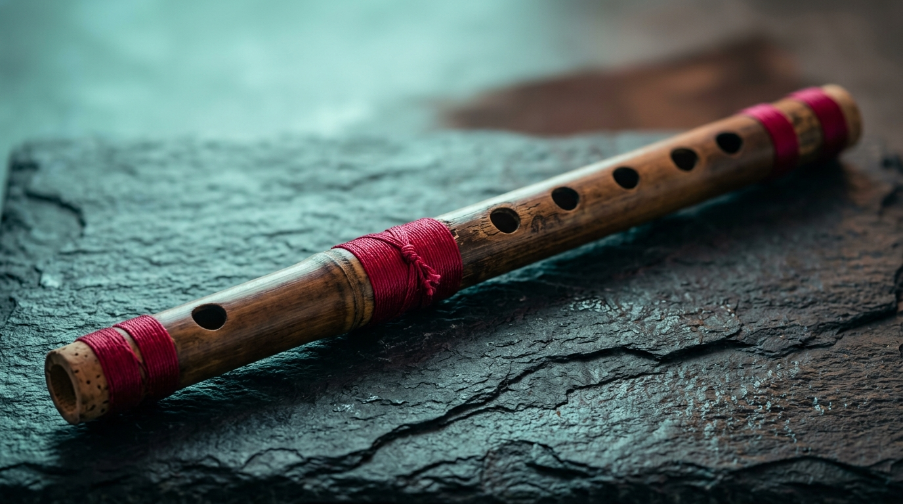
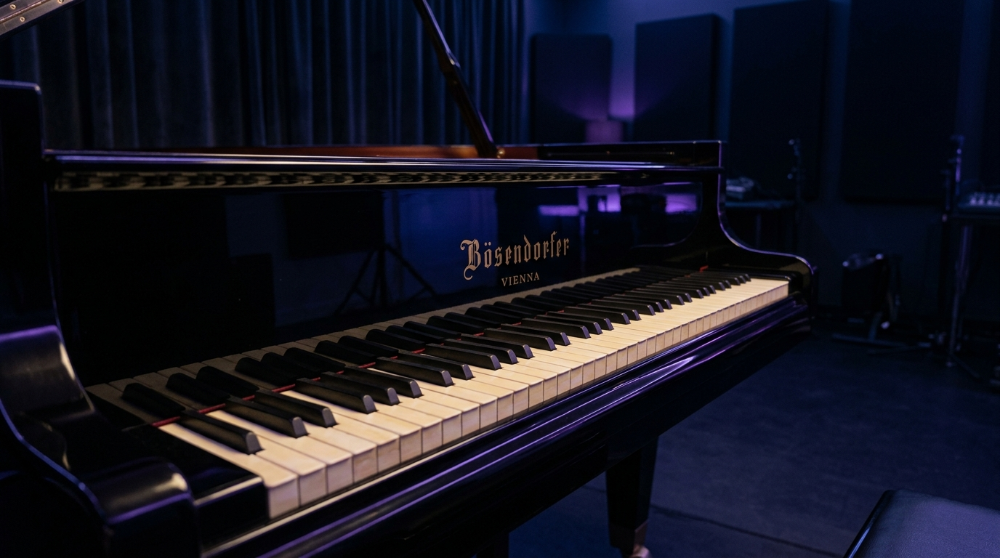
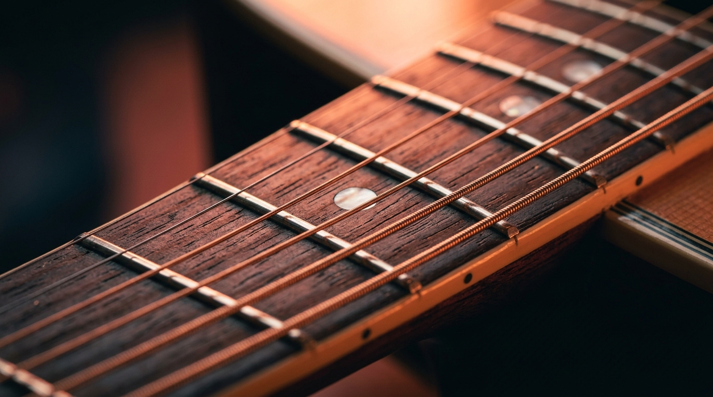
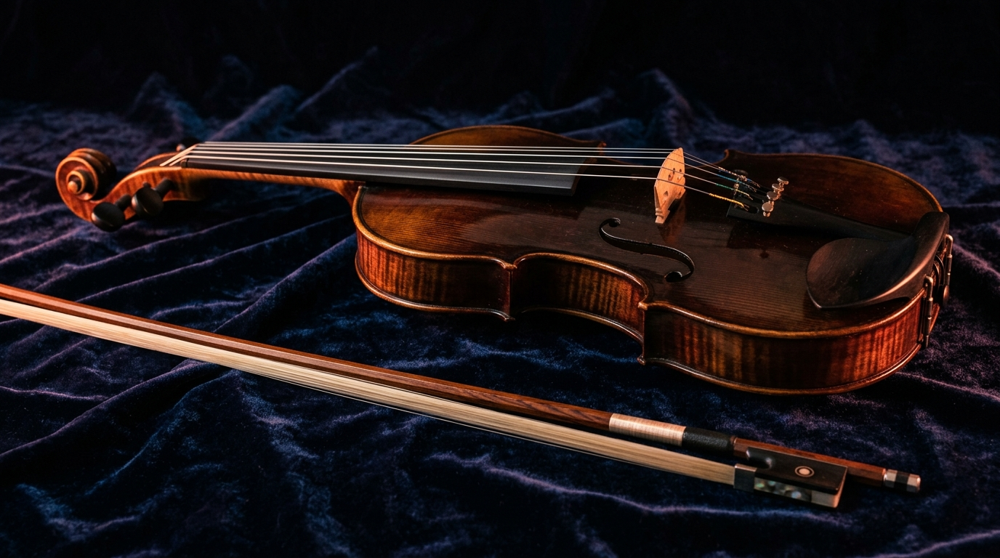
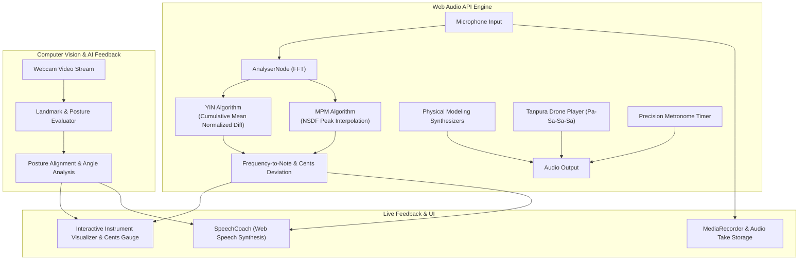

# 🎵 VIBEX — Next-Gen Music Instrument Learning Platform

<div align="center">



### **Master Piano, Guitar, Violin, and Bansuri with Real-Time Audio AI & Computer Vision**

[](https://opensource.org/licenses/Apache-2.0)
[](https://react.dev/)
[](https://www.typescriptlang.org/)
[](https://vitejs.dev/)
[](https://tailwindcss.com/)
[](https://developer.mozilla.org/en-US/docs/Web/API/Web_Audio_API)
[](CONTRIBUTING.md)

[Features](#-key-features) • [Instruments](#-supported-instruments) • [Architecture](#-architecture--dsp-engine) • [Quick Start](#-quick-start) • [Curriculum](#-curriculum-roadmap) • [Contributing](#-contributing)

</div>

---

## 📖 Overview

**VIBEX** is an interactive, gamified, cross-platform music education ecosystem designed to bridge traditional instrumental pedagogy with modern web technologies.

By combining low-latency **in-browser digital signal processing (DSP)**, dual pitch detection algorithms (**YIN** & **McLeod Pitch Method / MPM**), **computer vision posture evaluation**, and an **AI vocal coach**, VIBEX provides instantaneous, multi-sensory feedback for both Western and Indian Classical traditions.

---

## ✨ Key Features

### 🎯 1. Dual DSP Pitch Tracking Engine
- **YIN Algorithm**: Difference function with cumulative mean normalized difference and parabolic interpolation for sub-sample accuracy.
- **McLeod Pitch Method (MPM)**: Normalized Square Difference Function (NSDF) peak picking for complex acoustic timbres.
- **Real-Time Cents Meter**: High-precision gauge measuring micro-tonal pitch deviation ($-50$ to $+50$ cents) with instant visual status (*Sharp*, *Flat*, *In Tune*).
- **Acoustic Drone & Tanpura**: Built-in 4-string acoustic Tanpura synthesizer (*Pa–Sa–Sa–Sa*) for modal grounding and Indian Classical *Swar Sadhana*.

### 👁️ 2. Real-Time Vision & Posture Evaluator
- Uses camera stream processing to analyze musician ergonomics in real time.
- Instrument-specific posture heuristics:
  - **Bansuri**: Lip aperture, blowhole angle, and relaxed fleshy finger pad coverage.
  - **Piano**: Curved finger arches, neutral wrist alignment, and shoulder relaxation.
  - **Guitar**: Thumb placement behind neck, wrist clearance, and fret-hand angle.
  - **Violin**: Straight bow stroke plane, scroll elevation, and relaxed bow-grip hold.
- Intelligent fallback to synthetic AI landmark simulation when camera access is restricted.

### 🗣️ 3. Real-Time AI Speech Coach
- Live verbal cues powered by the Web Speech Synthesis API.
- Non-intrusive voice feedback during practice sessions (*"A bit sharp, drop air angle slightly"*, *"Keep wrist elevated"*, *"Spot on intonation!"*).

### 🎼 4. Interactive Instrument Visualizers
- **Piano**: Dynamic 88-key grand piano roll with physical modeling harmonic synthesis.
- **Guitar**: 6-string interactive fretboard with finger number coordinates and string indicators.
- **Violin**: 4-string fingerboard ($G, D, A, E$) with live bow direction indicators (*Up-bow / Down-bow*).
- **Bansuri (Flute)**: Full 6-hole finger coverage display with half-hole and shading indicators for *Komal* and *Teevra* swaras.

### ⏱️ 5. Integrated Practice Suite
- **Acoustic Metronome**: Subdivisions, customizable BPM, accent downbeats, and visual pendulum ticks.
- **Bansuri Scale Tuner**: Calibrated for concert flutes across various keys (*C Medium, E Bass, G Natural, D Medium, F Bass, A Bass*).
- **Session Recorder & Take History**: Record microphone takes directly in WebM, replay sessions, compute average pitch accuracy, and track performance scores.
- **Ear Training Gym**: Interactive interval, chord, single-note, and Indian Classical *Swara* recognition challenges with an XP progression system.

---

## 🎻 Supported Instruments

<div align="center">

| Instrument | Visualizer Type | Key Disciplines & Focus | Acoustic Sound Model |
| :--- | :--- | :--- | :--- |
| **Piano** | Grand Keyboard Roll | Triads, chord voicings, Hanon agility, posture | Tri-harmonic partials with soft hammer transient |
| **Guitar** | 6-String Fretboard | Open & barre chords, pentatonic licks, fingerstyle | Karplus-Strong string synthesis & resonant filter |
| **Violin** | 4-String Fingerboard | Fretless intonation, bowing angle, bow balance | Sawtooth dual-filter violin body resonator |
| **Bansuri** | 6-Hole Bamboo Flute | Embouchure, 6-hole pad sealing, *Alankars*, *Meend* | Sine-overtone woodwind synthesis + breath noise |

</div>

### Gallery

<div align="center">
  
  
  <br/><br/>
  
  
</div>

---

## 🏗️ Architecture & DSP Engine

VIBEX runs completely client-side in the browser, eliminating round-trip latency for audio and video processing:



### Digital Signal Processing (DSP) Specs:
- **Sample Rate**: $44,100 \text{ Hz} / 48,000 \text{ Hz}$ standard browser audio context
- **Buffer Size**: $2048$ samples for high frequency resolution
- **Detection Range**: $50 \text{ Hz} \text{ (low double bass / bass notes)} \longleftrightarrow 2200 \text{ Hz} \text{ (soprano / high bansuri range)}$
- **Tuning Calibration**: Standard A4 = $440 \text{ Hz}$ (with customizable root notes for Indian classical $Sa$)

---

## 🗺️ Curriculum Roadmap

Each instrument features an extensive 5-tier roadmap spanning hundreds of structured exercises and repertoire milestones:

1. **Tier 1: Absolute Beginner**
   - Ergonomics, proper hand/lip placement, open string / note production, tone clarity.
2. **Tier 2: Early Intermediate**
   - Note transitions, rhythm consistency, major/minor scales, basic Sargam patterns.
3. **Tier 3: Intermediate**
   - Micro-tonal accuracy, chord inversions, bowing dynamics, speed building (*Drut laya*).
4. **Tier 4: Advanced**
   - Complex modulations, ornamental techniques (*Meend, Gamak, Vibrato, Hammer-ons*), polyrhythms.
5. **Tier 5: Professional / Performance**
   - Raga improvisation (*Alaap-Jor-Jhala*), full concert repertoire, micro-tuning perfection.

---

## ⚡ Quick Start

### Prerequisites
- [Node.js](https://nodejs.org/) (version 18 or higher) or [Bun](https://bun.sh/)
- A modern web browser supporting **Web Audio API** and **WebRTC** (Chrome, Firefox, Edge, Safari)
- A working microphone (and optional webcam for posture tracking)

### 1. Clone the Repository
```bash
git clone https://github.com/mrunal-g-ai/VIBEX-Music-Instrument-Learning-Platform.git
cd VIBEX-Music-Instrument-Learning-Platform
```

### 2. Install Dependencies
Using **npm**:
```bash
npm install
```

Or using **bun**:
```bash
bun install
```

### 3. Start the Development Server
```bash
npm run dev
```

Open your browser and navigate to:
```
http://localhost:3000
```

### 4. Build for Production
```bash
npm run build
npm run preview
```

---

## 💻 Tech Stack

| Category | Technology |
| :--- | :--- |
| **Frontend Framework** | React 19, TypeScript, Vite 8 |
| **Styling & Animation** | Tailwind CSS v4, Motion (Framer Motion), Canvas-Confetti |
| **Iconography** | Lucide React |
| **Audio Processing** | Web Audio API, Custom YIN & MPM pitch trackers, MediaRecorder |
| **Computer Vision** | HTML5 Canvas, MediaDevices WebRTC stream, Landmark simulation |
| **Audio Coach** | Web Speech Synthesis API |
| **State & Data** | Pure React Hooks + Typed Modular Curriculum Store |

---

## 📁 Project Structure

```
VIBEX-Music-Instrument-Learning-Platform/
├── public/                     # Static public assets
├── src/
│   ├── assets/
│   │   └── images/             # Instrument hero imagery & banners
│   ├── components/
│   │   ├── instruments/        # Interactive visualizer components
│   │   │   ├── BansuriVisualizer.tsx
│   │   │   ├── GuitarVisualizer.tsx
│   │   │   ├── PianoVisualizer.tsx
│   │   │   └── ViolinVisualizer.tsx
│   │   ├── layout/             # Navigation bars & shell layout
│   │   │   ├── Navbar.tsx
│   │   │   └── BottomNav.tsx
│   │   ├── practice/           # Practice room components
│   │   │   ├── MetronomeDrawer.tsx
│   │   │   ├── PitchVisualizer.tsx
│   │   │   ├── SessionRecorderModal.tsx
│   │   │   └── VisionMonitor.tsx
│   │   └── tuner/              # Dedicated tuning utilities
│   │       └── BansuriTunerModal.tsx
│   ├── data/
│   │   └── curriculumData.ts   # 5-tier lesson definitions & exercise data
│   ├── services/
│   │   ├── audioEngine.ts      # Web Audio API engine (YIN, MPM, Synths, Drone)
│   │   └── speechCoach.ts      # Real-time Web Speech voice instructor
│   ├── types/
│   │   └── vibex.ts            # Type definitions, interfaces, and models
│   ├── views/                  # Primary screen views
│   │   ├── DashboardView.tsx
│   │   ├── CurriculumMapView.tsx
│   │   ├── PracticeView.tsx
│   │   └── EarTrainingGymView.tsx
│   ├── App.tsx                 # Root application component
│   ├── main.tsx                # Entry point
│   └── index.css               # Global theme tokens and styles
├── package.json
├── tsconfig.json
├── vite.config.ts
└── README.md
```

---

## 🔒 Permissions & Privacy

- **Microphone Access**: Used strictly locally within your browser's `AudioContext` to analyze audio frequencies. No audio is ever uploaded to external servers without explicit user recording export.
- **Camera Access**: Used on-device to inspect posture landmarks. No video streams are saved or transmitted remotely.

---

## 🤝 Contributing

Contributions to VIBEX are warmly welcome! Whether you are adding new instrument visualizers, transcribing exercises, improving DSP algorithms, or designing themes:

1. **Fork the Repository**
2. **Create your Feature Branch**:
   ```bash
   git checkout -b feature/amazing-feature
   ```
3. **Commit your Changes**:
   ```bash
   git commit -m "Add amazing new instrument module"
   ```
4. **Push to the Branch**:
   ```bash
   git push origin feature/amazing-feature
   ```
5. **Open a Pull Request**

---

## 📄 License

This project is licensed under the **Apache-2.0 License** — see the [LICENSE](LICENSE) file for details.

---

<div align="center">

Made with 🎶 for musicians, learners, and educators worldwide.

**[⭐ Star this repository](https://github.com/mrunal-g-ai/VIBEX-Music-Instrument-Learning-Platform) if you find it inspiring!**

</div>
